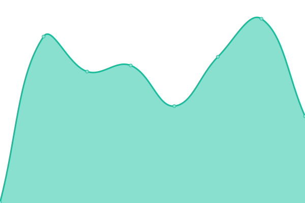

# [📈 Live Status](https://pages.icampos.me): <!--live status--> **🟩 All systems operational**

This repository contains the open-source uptime monitor and status page for [Isaac Campos](https://pages.icampos.me), powered by [Upptime](https://github.com/upptime/upptime).

With [Upptime](https://upptime.js.org), you can get your own unlimited and free uptime monitor and status page, powered entirely by a GitHub repository. We use [Issues](https://github.com/caco26i/upptime-runit/issues) as incident reports, [Actions](https://github.com/caco26i/upptime-runit/actions) as uptime monitors, and [Pages](https://pages.icampos.me) for the status page.

<!--start: status pages-->
<!-- This summary is generated by Upptime (https://github.com/upptime/upptime) -->
<!-- Do not edit this manually, your changes will be overwritten -->
<!-- prettier-ignore -->
| URL | Status | History | Response Time | Uptime |
| --- | ------ | ------- | ------------- | ------ |
|  [Runit Solutions](https://runitcr.com/) | 🟩 Up | [runit-solutions.yml](https://github.com/caco26i/upptime-runit/commits/HEAD/history/runit-solutions.yml) | 

 325ms
     
 | 

<a href="https://pages.icampos.me/history/runit-solutions">100.00%</a>
    

|  [Vichima Consultores](http://vichimaconsultores.com/) | 🟩 Up | [vichima-consultores.yml](https://github.com/caco26i/upptime-runit/commits/HEAD/history/vichima-consultores.yml) | 

 258ms
     
 | 

<a href="https://pages.icampos.me/history/vichima-consultores">100.00%</a>
    

|  [Vichima Electrónica](https://vichimaelectronica.com/) | 🟩 Up | [vichima-electronica.yml](https://github.com/caco26i/upptime-runit/commits/HEAD/history/vichima-electronica.yml) | 

 698ms
     
 | 

<a href="https://pages.icampos.me/history/vichima-electronica">100.00%</a>
    

<!--end: status pages-->

[**Visit our status website →**](https://pages.icampos.me)

## 📄 License

- Powered by: [Upptime](https://github.com/upptime/upptime)
- Code: [MIT](./LICENSE) © [Isaac Campos](https://pages.icampos.me)
- Data in the `./history` directory: [Open Database License](https://opendatacommons.org/licenses/odbl/1-0/)
